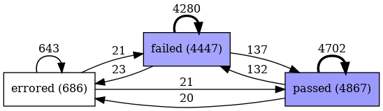

# DevFlow Analyzer

An agentic ML system that applies process mining to CI/CD build data, identifies bottlenecks and failure patterns, and generates actionable insights using LLM-powered natural language generation.

## Overview

DevFlow Analyzer takes CI/CD event logs (build history), performs process mining analysis, and generates comprehensive reports explaining:

- **Build Health** - Overall success rates and trends
- **Bottlenecks** - Slow builds and performance issues
- **Failure Patterns** - Which projects fail most and why
- **Recommendations** - Actionable steps to improve CI/CD performance

## Architecture

```
┌─────────────────────┐
│   CI/CD Build Logs  │  (TravisTorrent, CSV)
└──────────┬──────────┘
           │
           ▼
┌─────────────────────┐
│   Process Analyzer  │  (PM4Py)
│  - Load & validate  │
│  - Compute metrics  │
│  - Identify issues  │
└──────────┬──────────┘
           │
           ▼
┌─────────────────────┐
│  Structured Metrics │  (BuildAnalysisResult)
│  - Success rates    │
│  - Duration stats   │
│  - Bottlenecks      │
└──────────┬──────────┘
           │
     ┌─────┴─────┐
     │           │
     ▼           ▼
┌──────────┐ ┌──────────────┐
│  Agent   │ │ LLM Reporter │
│(LangGraph)│ │ (LangChain)  │
│ - Tools  │ │ - Templates  │
│ - ReAct  │ │ - Sections   │
└────┬─────┘ └──────┬───────┘
     │              │
     ▼              ▼
┌──────────┐ ┌─────────────┐
│ Dynamic  │ │  CI/CD      │
│ Analysis │ │  Report     │
└──────────┘ └─────────────┘
```

## Process Mining

DevFlow Analyzer uses [PM4Py](https://pm4py.fit.fraunhofer.de/) to apply process mining techniques to CI/CD data. The system generates a **Directly-Follows Graph (DFG)** that visualizes build status transitions.

### Example: TravisTorrent Dataset

The following DFG was generated from the TravisTorrent dataset (10,000 CI/CD builds from 21 open-source Java projects):



In this graph:
- **Nodes** represent build statuses (passed, failed, errored, canceled)
- **Edges** show transitions between consecutive builds per project
- **Edge labels** indicate the frequency of each transition

This visualization helps identify patterns such as:
- Recovery rate from failures (failed → passed)
- Build stability (passed → passed chains)
- Error clustering and infrastructure issues (errored states)

## Features

- **Agentic analysis** - ReAct-style agent that autonomously investigates CI/CD issues
- **Provider-agnostic LLM support** - Works with Anthropic Claude, OpenAI GPT, or local Ollama models
- **Process mining integration** - Uses PM4Py for DFG visualization and metrics
- **Structured analysis** - Dataclasses for clean JSON serialization
- **Configurable prompts** - Easy to customize report generation

## Installation

```bash
# Clone repository
git clone https://github.com/albertodiazdurana/devflow-analyzer.git
cd devflow-analyzer

# Create virtual environment
python3.11 -m venv .venv
source .venv/bin/activate

# Install dependencies
pip install -r requirements.txt

# Copy environment template
cp .env.example .env
# Edit .env with your API keys
```

## Configuration

Edit `.env` to configure LLM providers:

```bash
# Anthropic (recommended)
ANTHROPIC_API_KEY=sk-ant-...

# OpenAI
OPENAI_API_KEY=sk-...

# Ollama (local, no key needed)
OLLAMA_BASE_URL=http://localhost:11434
```

For Ollama on Windows with WSL, see [docs/ollama-wsl-setup.md](docs/ollama-wsl-setup.md).

## Usage

### Agent-Based Analysis (Recommended)

```python
from pathlib import Path
from src.process_analyzer import ProcessAnalyzer
from src.agent import DevFlowAgent

# Load and analyze CI/CD data
analyzer = ProcessAnalyzer()
analyzer.load_data(Path("data/sample/travistorrent_10k.csv"))
result = analyzer.analyze()

# Create agent and investigate
agent = DevFlowAgent()  # defaults to gpt-4o-mini
response = agent.investigate(result, "Which project has the highest failure rate?")
print(response)

# Or run a comprehensive analysis
response = agent.analyze(result)
print(response)
```

### Report Generation

```python
from src.llm_reporter import LLMReporter

# Generate structured report
reporter = LLMReporter(model_key="gpt-4o-mini")
report = reporter.generate_report(result)
print(report.to_markdown())
```

### Generate DFG Visualization

```python
analyzer.generate_dfg(Path("outputs/figures/dfg.png"))
```

### Available Models

| Key | Provider | Model | Tool Calling |
|-----|----------|-------|--------------|
| `gpt-4o-mini` | OpenAI | GPT-4o Mini | Yes |
| `gpt-4o` | OpenAI | GPT-4o | Yes |
| `claude-sonnet` | Anthropic | Claude Sonnet 4 | Yes |
| `claude-haiku` | Anthropic | Claude Haiku 4 | Yes |
| `ollama-llama3` | Ollama | Llama 3 (local) | No |
| `ollama-mistral` | Ollama | Mistral (local) | No |

**Note:** The agent requires models with tool calling support. For local models, use the reporter instead. See [docs/decisions/DEC-001-default-llm-provider.md](docs/decisions/DEC-001-default-llm-provider.md) for details.

## Project Structure

```
devflow-analyzer/
├── src/
│   ├── models.py           # Data classes
│   ├── process_analyzer.py # PM4Py analysis
│   ├── llm_provider.py     # LLM factory
│   ├── llm_reporter.py     # Report generation
│   ├── agent.py            # ReAct agent with tools
│   └── evaluation.py       # MLflow tracking & A/B testing
├── prompts/                # Prompt templates
├── tests/                  # Unit tests (86 tests)
├── data/sample/            # Sample datasets
├── outputs/                # Generated reports & figures
├── mlruns/                 # MLflow experiment logs
└── docs/                   # Documentation & decisions
```

## Data Format

DevFlow Analyzer works with TravisTorrent-style CSV data. Required columns:

| Column | Description |
|--------|-------------|
| `tr_build_id` | Unique build identifier |
| `gh_project_name` | Project name |
| `tr_status` | Build status (passed/failed/errored) |
| `tr_duration` | Build duration in seconds |
| `gh_build_started_at` | Build timestamp |

## Development Progress

- [x] **Day 1**: Foundation & Data Pipeline
  - Process analyzer with PM4Py
  - Data models with serialization
  - DFG visualization

- [x] **Day 2**: Core Modules
  - Provider-agnostic LLM factory
  - Prompt templates
  - LLM-powered report generation

- [x] **Day 3**: Agentic System
  - ReAct-style agent with LangGraph
  - Tools: summary stats, bottlenecks, failures, project comparison
  - Dynamic analysis and investigation

- [x] **Day 4**: Evaluation Pipeline
  - MLflow experiment tracking
  - ROUGE scores for output quality
  - Cost tracking per model
  - A/B testing framework for model comparison

- [x] **Day 5**: Application & Documentation
  - Streamlit UI with 4 tabs (Upload, Metrics, Agent, Evaluation)
  - Demo notebook
  - Complete documentation

## Quick Start

```bash
# Run the Streamlit app
streamlit run app.py

# View MLflow experiments
mlflow ui --port 5000
```

## Testing

```bash
# Run all tests
pytest tests/ -v

# Run specific test file
pytest tests/test_analyzer.py -v
```

## License

MIT

## Author

**Alberto Diaz Durana**
[GitHub](https://github.com/albertodiazdurana) | [LinkedIn](https://www.linkedin.com/in/albertodiazdurana/)
